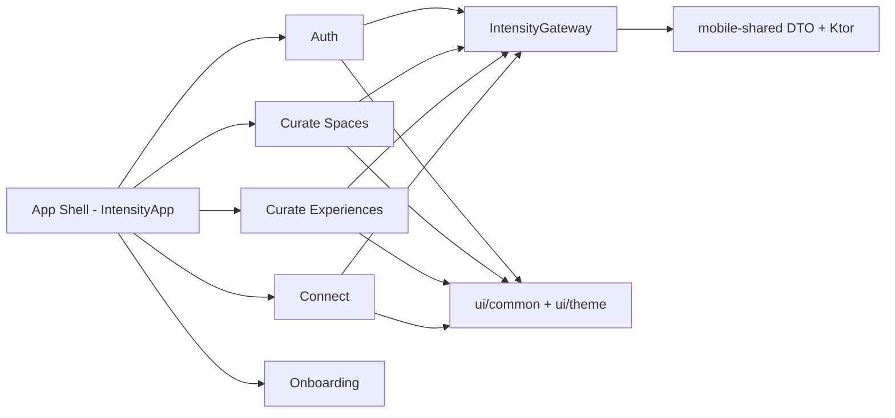

# Mapa de Acoplamento - Intensity (Client)

## Escopo e objetivo

Este documento cobre apenas o client em `Intensity`, focando em:

- limites de contexto (bounded contexts)
- acoplamentos indevidos entre contextos
- hotspots para iniciar refatoracao com seguranca

> Observacao: no client atual, os modulos relevantes sao `mobile-app` e `mobile-shared`.

---

## Visao estrutural atual

### Modulos

- `mobile-app`: UI Compose, shell de navegacao, estado de sessao, onboarding, i18n, gateway de aplicacao.
- `mobile-shared`: cliente HTTP (Ktor), contratos DTO e utilitarios de erro HTTP.

### Camadas inferidas

1. **UI/Feature** (`ui/*`)
2. **Aplicacao/Fachada** (`data/IntensityGateway`, `data/AppSession`)
3. **Infra/Contratos** (`mobile-shared`)
4. **Plataforma** (`androidMain`, `iosMain`) para `actual` de base URL, engine e stores

---

## Context map proposto (alvo de fronteiras)

### Contextos de dominio funcional

- **Auth**
  - login/cadastro e estabelecimento de sessao
- **Curate Spaces**
  - selecao de grupo e caixinha
- **Curate Experiences**
  - listar/criar/editar experiencias da caixinha selecionada
- **Connect**
  - abrir caixinha e ativar experiencia para participante
- **Onboarding**
  - fluxo inicial e manual

### Contextos transversais

- **App Shell**
  - roteamento principal, troca de telas por `accessMode`, ciclo de vida de sessao
- **Design System/UI Shared**
  - componentes comuns (`ui/common`, `ui/theme`)
- **Contracts/Infra API**
  - DTOs, cliente HTTP e mapeamento de falhas (`mobile-shared`)

---

## Mapa de dependencias (alto nivel)

---

## Matriz de acoplamento entre contextos

| Origem | Destino | Nivel | Evidencia |
|---|---|---|---|
| App Shell | Todos os fluxos | Alto | `IntensityApp` importa e orquestra Auth, Group, Box, Experience, Session |
| Curate Experiences | Session | Alto | `ui.experience` importa `ui.session.ExperienceBoxTypeCatalog` |
| Session | Curate Experiences | Alto | `ui.session` importa `ui.experience.ExperienceRevealCard` |
| Box/Curate Spaces | Session | Medio/Alto | `ui.box` usa `ExperienceBoxTypeCatalog` de `ui.session` |
| UI features | DTOs de API | Medio | telas importam `com.intensity.mobile.shared.model.*` diretamente |
| UI wizard | Infra de erro HTTP | Medio | `ExperienceCreationWizard` usa `readableIntensityHttpError` de `mobile-shared` |
| Data store | i18n UI enum | Medio | `IntensityLanguageStore` depende de `AppLanguage` |

---

## Hotspots de acoplamento (priorizados)

## 1) Ciclo entre `session` e `experience` (**Critico**)

### Sinal

- `ui.session.ExperienceSessionScreens` importa `ui.experience.ExperienceRevealCard`
- `ui.experience.ExperiencesScreen` e `ui.experience.ExperienceCreationWizard` importam `ui.session.ExperienceBoxTypeCatalog`

### Impacto

- cria dependencia bidirecional entre contextos
- aumenta custo de mudanca em ambos os fluxos
- dificulta evolucao para arquitetura por fatias

### Direcao de correcao

- extrair `ExperienceBoxTypeCatalog` para um contexto compartilhado neutro (ex.: `ui.common.catalog` ou `core/catalog`)
- mover `ExperienceRevealCard` para shared UI caso realmente seja componente reutilizavel transversal
- impedir import cruzado direto entre `ui.session` e `ui.experience`

---

## 2) `IntensityApp` como orquestrador monolitico (**Alto**)

### Sinal

- `IntensityApp` concentra: bootstrap de idioma, onboarding, sessao, branching de `accessMode`, navegacao e overlays.

### Impacto

- ponto unico de alto acoplamento
- baixa testabilidade de fluxos
- risco elevado de regressao ao alterar navegacao/sessao

### Direcao de correcao

- introduzir roteador explicito (ex.: destinos selados por fluxo)
- reduzir shell para composicao de nav + providers
- delegar regra de fluxo para use cases/coordenadores por contexto

---

## 3) DTOs de API no limite da UI (**Alto**)

### Sinal

- telas consumindo `BoxDto`, `GroupDetailDto`, `ExperienceDto`, `ExperienceSummaryDto` diretamente.

### Impacto

- UI acoplada ao contrato remoto
- mudancas de API afetam renderizacao e logica visual

### Direcao de correcao

- criar mapeadores para modelos de feature/UI (`ExperienceCardModel`, `GroupOptionModel`, etc.)
- manter DTO apenas no gateway/repository

---

## 4) Erro HTTP de infra tratado na tela (**Medio**)

### Sinal

- `ExperienceCreationWizard` chama `readableIntensityHttpError` (infra) para construir mensagem de UI.

### Impacto

- vaza detalhe de transporte para camada de apresentacao

### Direcao de correcao

- gateway/use case retorna `UiError` (ou `Result` tipado) pronto para exibicao
- UI nao conhece tipos de erro HTTP/Ktor

---

## 5) Persistencia de idioma acoplada ao tipo de i18n da UI (**Medio**)

### Sinal

- `IntensityLanguageStore` depende de `AppLanguage`.

### Impacto

- infra de storage conhece tipo da camada de apresentacao

### Direcao de correcao

- armazenar `languageCode` no storage (ex.: `pt`, `en`)
- mapear para `AppLanguage` somente na borda i18n

---

## 6) `ui/common` como grande ponto compartilhado (**Baixo/Medio**)

### Sinal

- features importam muitos simbolos de `ui/common`.

### Impacto

- com o tempo vira "dumping ground" de componentes sem fronteira clara

### Direcao de correcao

- segmentar `ui/common` por subdominio visual (`layout`, `inputs`, `feedback`, `topbar`, etc.)
- criar contratos estaveis para kit visual

---

## O que esta fora de um contexto bem delimitado

- catalogo de tipo de caixinha esta no pacote `session`, mas e usado por `session`, `experience` e `box`.
- componente de experiencia (`ExperienceRevealCard`) participa de fluxo `session`, criando dependencia cruzada.
- shell central conhece detalhes demais de cada fluxo.
- modelos de API chegam ate as telas sem camada anti-corrupcao.

Em termos de fronteira de contexto, os vazamentos principais hoje estao entre:

1. **Session <-> Curate Experiences**
2. **UI <-> Contratos API**
3. **Shell <-> Regras de fluxo**

---

## Plano de refatoracao orientado a desacoplamento

## Fase 1 - Quebrar o ciclo mais caro (curto prazo)

- extrair `ExperienceBoxTypeCatalog` para pacote neutro compartilhado
- ajustar imports de `ui.session`, `ui.experience`, `ui.box`
- mover `ExperienceRevealCard` para shared UI (se reuso for real)

**Resultado esperado:** remover dependencia bidirecional entre `session` e `experience`.

## Fase 2 - Isolar borda de API

- introduzir mapeadores DTO -> modelos de tela
- ajustar `gateway`/repositorio para retornar modelos de app

**Resultado esperado:** reduzir impacto de mudanca de API na UI.

## Fase 3 - Enxugar App Shell

- separar roteamento de regras de negocio de sessao/onboarding
- manter `IntensityApp` como composicao de providers + nav

**Resultado esperado:** shell mais estavel, testavel e legivel.

## Fase 4 - Limpeza estrutural

- reorganizar `ui/common`
- padronizar contratos de erro para UI
- revisar stores `expect/actual` para interfaces testaveis

---

## Backlog tecnico sugerido (prioridade)

1. **P1** Extrair `ExperienceBoxTypeCatalog` de `ui.session`
2. **P1** Remover ciclo `ui.session` <-> `ui.experience`
3. **P2** Introduzir modelos de feature para substituir DTO em tela
4. **P2** Padronizar erro de dominio/UI (sem `readableIntensityHttpError` na tela)
5. **P3** Refatorar `IntensityApp` para roteador/coordenadores
6. **P3** Modularizar `ui/common`

---

## Arquivos de referencia (hotspots)

- `mobile-app/src/commonMain/kotlin/com/intensity/mobile/app/IntensityApp.kt`
- `mobile-app/src/commonMain/kotlin/com/intensity/mobile/app/ui/session/ExperienceSessionScreens.kt`
- `mobile-app/src/commonMain/kotlin/com/intensity/mobile/app/ui/session/ExperienceBoxTypeUi.kt`
- `mobile-app/src/commonMain/kotlin/com/intensity/mobile/app/ui/experience/ExperiencesScreen.kt`
- `mobile-app/src/commonMain/kotlin/com/intensity/mobile/app/ui/experience/ExperienceCreationWizard.kt`
- `mobile-app/src/commonMain/kotlin/com/intensity/mobile/app/data/IntensityGateway.kt`
- `mobile-shared/src/commonMain/kotlin/com/intensity/mobile/shared/IntensityApiClient.kt`
- `mobile-shared/src/commonMain/kotlin/com/intensity/mobile/shared/IntensityApiError.kt`

