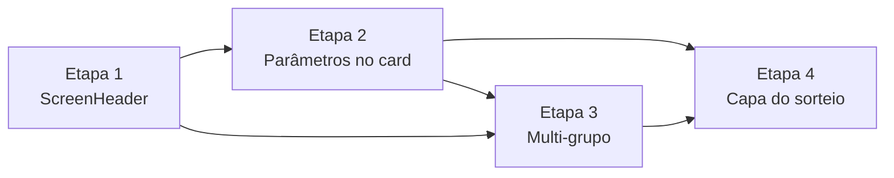

# Plano de desenvolvimento — backlog atual

Plano operacional para executar as quatro tarefas de [backlog.md](backlog.md), na ordem já definida lá.

**Referências:** @ref:backlog, @ref:refs (`docs/refs.yaml`), @ref:pt-br-design-system, @ref:pt-br-functional-components, @ref:pt-br-data-model.

**Stack:** client React/TypeScript (`client/`), API Java/Spring (`api/`), contrato @ref:openapi.

---

## Visão geral



| Etapa | Tarefa do backlog | Foco | Camadas |
|-------|-------------------|------|---------|
| 1 | Corrigir layout do cabeçalho com Voltar e Sair | Componente compartilhado | Client |
| 2 | Corrigir layout dos parâmetros no card de experiência | Componente compartilhado | Client |
| 3 | Refinar seleção multi-grupo no modo Experiences | Jornada + regra de negócio | API + Client |
| 4 | Compactar capa da carta sorteada com ênfase em intensidade | Ritual de sorteio | Client |

**Princípio:** estabilizar `ScreenHeader` e `ParameterStarField` antes de alterar telas de grupo e a capa do sorteio, para evitar retrabalho visual.

---

## Etapa 1 — Cabeçalho com Voltar e Sair

**Tarefa:** Corrigir layout do cabeçalho com Voltar e Sair  
**Objetivo:** Toolbar de ações separada do bloco de título/modo, estável com ou sem botão Voltar.

### 1.1 Análise e decisão de layout

- [ ] Inventariar consumidores de `ScreenHeader` e headers ad hoc (`InvitePreviewPage`, `AuthPage`, overlays).
- [ ] Capturar estado atual em 320px: telas com Voltar+Sair vs só Sair (`BoxSelectionPage`, `GroupSelectionPage`).
- [ ] Escolher abordagem (recomendado: **duas faixas** — toolbar + content em largura total).
- [ ] Registrar decisão em comentário em `ScreenHeader.tsx` ou nota no PR.

**Entregável:** decisão documentada; lista de arquivos impactados.

### 1.2 Implementar `ScreenHeader` em duas faixas

- [ ] Refatorar `ScreenHeader.tsx` / `ScreenHeader.module.css`:
  - Faixa `toolbar`: `leading` | spacer | `trailing`
  - Faixa `content`: `children` em 100% da largura
- [ ] Garantir slots vazios sem colapso assimétrico de margens.
- [ ] Respeitar `env(safe-area-inset-top)` e tokens `--space-page`, `--touch-min`.

**Arquivos:** `client/src/presentation/components/ScreenHeader.tsx`, `ScreenHeader.module.css`.

### 1.3 Validar consumidores principais

- [ ] Experiences: `GroupSelectionPage`, `BoxSelectionPage`, `ExperienceListPage`, `CreateBoxExperiencesPage`.
- [ ] Experience Box: `BoxHomePage`, `SharedMomentPage`, `CreateBoxPage`.
- [ ] Overlay: `CreationAssistant`.
- [ ] Remover CSS de header conflitante nos `.module.css` das páginas, se houver.

**Checklist visual:**
- [ ] `BoxSelectionPage` / `SharedMomentPage`: modo + título não espremidos entre botões.
- [ ] `GroupSelectionPage` / `BoxHomePage`: alinhamento de título consistente com telas que têm Voltar.
- [ ] 320px: sem sobreposição; alvos de toque ≥ 48px.

### 1.4 Overlays e alinhamento opcional

- [ ] Avaliar `QuickGuideOverlay`, `ShareInviteSheet`, `InvitePreviewPage`, `AuthPage` — migrar para o mesmo padrão se trivial.
- [ ] `npm run build` e testes do client passando.

**Gate da etapa 1:** todas as telas autenticadas listadas no backlog renderizam header estável; navegação (Voltar, Sair, Fechar) sem regressão.

---

## Etapa 2 — Parâmetros no card de experiência

**Tarefa:** Corrigir layout dos parâmetros no card de experiência  
**Objetivo:** Eliminar colisão de estrelas entre Esforço, Abertura e Novidade na lista do modo Experiences.

**Depende de:** Etapa 1 (header estável em `ExperienceListPage`).

### 2.1 Reproduzir e confirmar causa

- [ ] Abrir `ExperienceListPage` com card completo (3 parâmetros) em ~320px.
- [ ] Confirmar wrap compartilhado em `ParameterStarField.module.css` (`.inlineGroup` + `.inline`).
- [ ] Escolher abordagem (recomendado: layout **`list`** — uma linha empilhada por parâmetro).

### 2.2 Novo layout em `ParameterStarField`

- [ ] Adicionar layout `list` (ou `card`) em `ParameterStarField.tsx`.
- [ ] CSS: cada parâmetro = bloco fechado (ícone + label; estrelas na linha abaixo ou na mesma linha com `nowrap`).
- [ ] Proibir que estrelas de campos irmãos compartilhem a mesma linha visual.

**Arquivos:** `ParameterStarField.tsx`, `ParameterStarField.module.css`.

### 2.3 Conectar na lista de experiências

- [ ] `ExperienceSummaryMeta`: usar layout `list` no contexto de lista (prop `variant` ou troca de `inline` → `list`).
- [ ] Ajustar `ExperienceSummaryMeta.module.css` e, se necessário, `ExperienceCard.module.css` (`metaRow` + botão olho).
- [ ] Validar itens de outros participantes (mesmo meta, sem olho).

### 2.4 Regressão em outros contextos

- [ ] Assistente de criação (`layout="picker"`) inalterado.
- [ ] Capa do sorteio (`layout="cover"`) inalterada visualmente.
- [ ] Revisão manual em `ExperienceListPage`; build passando.

**Gate da etapa 2:** zero sobreposição de estrelas em mobile; intensidade, selo, olho, Editar e Excluir funcionais.

---

## Etapa 3 — Seleção multi-grupo (Experiences)

**Tarefa:** Refinar seleção multi-grupo no modo Experiences  
**Objetivo:** Jornada clara grupos → caixinhas; convite/saída no contexto certo; ao sair, remover experiências do autor.

**Depende de:** Etapa 1 (headers em `GroupSelectionPage` e `BoxSelectionPage`).

### 3.1 API — listagem de grupos enriquecida

- [ ] Decidir estratégia: enriquecer `GET /v1/groups` **ou** expor `GET /v1/groups/{id}/members` (OpenAPI já documenta o GET; controller hoje só tem DELETE).
- [ ] Estender `GroupResponse` com preview de membros (`displayName`).
- [ ] Atualizar `openapi/openapi.yaml`, `GroupQueryService`, DTOs.
- [ ] Testes de integração para listagem com nomes.

**Arquivos prováveis:** `api/.../group/`, `openapi/openapi.yaml`, testes em `api/src/test/java/`.

### 3.2 API — sair do grupo remove experiências do autor

- [ ] Estender `GroupMembershipService.leave`: antes de remover membresia, deletar experiências do(s) autor(es) nas caixinhas do `groupId`.
- [ ] Manter regra de último membro (exclusão total do grupo).
- [ ] Teste de integração: leave → experiências do participante ausentes nas caixinhas do grupo.

### 3.3 Client — domínio e tipos

- [ ] Estender `Group` em `boxTypes.ts` (membros ou `memberPreview`).
- [ ] Ajustar `ListGroupsUseCase` / adapter se necessário.
- [ ] Helper `formatGroupMemberPreview(names)` para abreviação ("Ana, Bruno e +2").

### 3.4 Client — `GroupSelectionPage`

- [ ] Criar `groupVisuals.ts` (cor estável por `groupId`: coral, teal, purple, yellow).
- [ ] Redesenhar cards: cor + preview de nomes; remover botões Convidar e Sair da listagem.
- [ ] Ajustar empty state apontando para entrada por convite global (`/auth` + `/join`).
- [ ] i18n `groups.*` em pt-BR, en, it.

### 3.5 Client — `BoxSelectionPage`

- [ ] Manter convite na toolbar (já existe).
- [ ] Adicionar **Sair do grupo** (padrão `BoxHomePage` + `LeaveGroupDialog`).
- [ ] Após sair: navegar para `/groups`; limpar `NavigationPort` se grupo ativo era o que saiu.

### 3.6 Copy, documentação e Experience Box

- [ ] Atualizar `groups.leaveDialog.message` — experiências **são removidas** ao sair.
- [ ] Alinhar copy de saída no `BoxHomePage` (sessão conjunta) à nova regra, se aplicável.
- [ ] Atualizar @ref:pt-br-data-model e @ref:pt-br-functional-components (ajuste mínimo).

**Gate da etapa 3:**
- [ ] 2+ grupos distinguíveis na listagem (cor + nomes).
- [ ] Convite só dentro do grupo; entrada global por convite intacta.
- [ ] Sair em `BoxSelectionPage` remove contribuições do usuário (verificado via API).
- [ ] Build API + client; testes de integração passando.

---

## Etapa 4 — Capa da carta sorteada

**Tarefa:** Compactar capa da carta sorteada com ênfase em intensidade  
**Objetivo:** Card retangular sem scroll; intensidade em destaque; parâmetros compactos; selo discreto.

**Depende de:** Etapa 2 (layouts de parâmetro estáveis em `ParameterStarField`).

### 4.1 Análise de composição

- [ ] Medir altura atual da capa (`DrawResultCard.module.css`, `overflow: auto`).
- [ ] Definir grid da capa (ex.: label opcional → hero intensidade → 3 colunas de parâmetros → selo mínimo).
- [ ] Validar em 320px e 390px sem scroll.

### 4.2 Componentes novos / variantes

- [ ] `IntensityHero` — número grande (1–5) + label "Intensidade".
- [ ] `ExperienceSummaryMeta variant="drawCover"` ou `DrawCardCover` dedicado.
- [ ] `ParameterStarsGroup layout="drawCover"` — compacto (estrelas `xs`/`sm`, 3 colunas ou linha única).
- [ ] `IntegritySeal variant="minimal"` — canto inferior, opacidade baixa.

**Arquivos:** `DrawResultCard.tsx`, `DrawResultCard.module.css`, componentes em `presentation/components/`.

### 4.3 Integrar na capa

- [ ] Remover `overflow: auto`; usar `overflow: hidden`.
- [ ] Altura fixa ou `aspect-ratio` consistente.
- [ ] Manter face revelada e animação de flip inalteradas.
- [ ] i18n: `sharedMoment.intensityLabel` (e equivalentes en/it).

### 4.4 Regressão e documentação

- [ ] `ExperienceListPage` e layout `list` da Etapa 2 sem degradação.
- [ ] Ritual em `SharedMomentPage`: sortear → capa → revelar.
- [ ] Ajuste mínimo em @ref:pt-br-functional-components se mencionar só chip de intensidade.
- [ ] Build passando.

**Gate da etapa 4:** capa sem barra de rolagem; intensidade hero legível; selo quase imperceptível mas acessível (`aria-label` / `title`).

---

## Validação final (todas as etapas)

Executar após a Etapa 4:

| Fluxo | O que verificar |
|-------|-----------------|
| Login Experiences | Lista de grupos com cores e nomes → caixinhas → lista de experiências |
| Card de experiência | Parâmetros sem colisão; olho, editar, excluir OK |
| Cabeçalho | Voltar + Sair em sub-telas; só Sair na raiz do modo |
| Sair do grupo | Em `BoxSelectionPage`; diálogo correto; experiências removidas |
| Convite | Global na auth; gerar convite só dentro do grupo |
| Sorteio | Capa compacta sem scroll; revelação OK |

**Comandos sugeridos:**

```bash
# Client
cd client && npm run build && npm test

# API
cd api && ./mvnw test
```

---

## Ordem de PRs sugerida

Para revisão incremental e merges menores:

1. **PR 1** — Etapa 1 (`ScreenHeader` + validação visual)
2. **PR 2** — Etapa 2 (`ParameterStarField` layout `list` + `ExperienceCard`)
3. **PR 3** — Etapa 3a (API: membros na listagem + leave com cascade)
4. **PR 4** — Etapa 3b (Client: `GroupSelectionPage` + `BoxSelectionPage` + i18n + docs)
5. **PR 5** — Etapa 4 (`DrawCardCover` / capa do sorteio)

Os PRs 3a e 3b podem ser um único PR se preferir entrega atômica da jornada multi-grupo.

---

## Estimativa relativa de esforço

| Etapa | Complexidade | Motivo |
|-------|--------------|--------|
| 1 | Média | Um componente, muitos consumidores; só client |
| 2 | Baixa–média | CSS/layout; risco de regressão em `cover`/`picker` |
| 3 | Alta | API + client + mudança de regra de negócio + docs |
| 4 | Média | Novos subcomponentes; depende de layouts de parâmetro |

**Total:** 4 entregas sequenciais; a Etapa 3 é a mais longa por envolver backend e copy de produto.
